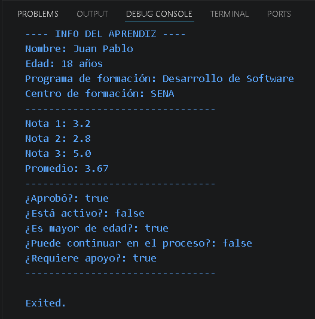

# Mi primer programa en Dart

## 1. Nombre del aprendiz
Juan Pablo Serna Martínez

## 2. Número de ficha
3256538

## 3. Programa de formación
Análisis y Desarrollo de Software

## 4. Descripción del proyecto
Este proyecto es un programa básico en Dart que representa el perfil de un
aprendiz del SENA. Registra sus datos personales y académicos, calcula el
promedio de tres notas, y valida su estado (si aprobó, si está activo, si es
mayor de edad y si puede continuar en el proceso de formación).

## 5. Objetivo de la actividad
Aplicar los conceptos básicos de Dart (variables, tipos de datos, operadores
y comentarios) mediante la creación de un programa funcional, y publicarlo en
un repositorio de GitHub siguiendo buenas prácticas.

## 6. Temas trabajados
- Variables (`var`, `final`, `const`) y tipos explícitos
- Tipos de datos: `String`, `int`, `double`, `bool`
- Operadores aritméticos (`+ - * /`)
- Operadores relacionales (`> < >= <= == !=`)
- Operadores lógicos (`&& || !`)
- Comentarios de una línea y de varias líneas

## 7. Instrucciones para ejecutar el programa
1. Clona este repositorio: `git clone <URL-del-repositorio>`
2. Abre la carpeta en VS Code.
3. Abre el archivo `bin/main.dart`.
4. Presiona F5, o ejecuta desde la terminal con:
   ```
   dart run bin/main.dart
   ```
5. El resultado aparecerá en la consola.

## 8. Evidencia de ejecución


## 9. Preguntas de reflexión
- **¿Qué diferencia hay entre `var`, `final` y `const`?**
  Que si utilizamos var el valor puede cambiar, si usamos final el valor no cambia durante la ejecución y si se usa const eso significa que el valor nunca cambiará.    

- **¿Por qué es importante comentar el código?**
  Es una buena práctica ya que facilita la comprensión del codigo, es bueno porque se puede ir aprendiendo y se conoce que hace cada linea y para que sirve.

- **¿Qué dificultades tuviste al desarrollar el ejercicio?**
  Me enrrdé un poco al declarar las variables ya que no sabía cual era la mejor opción para cada una. 

## 10. Conclusión de la actividad
Con esta actividad aprendí a descargar el flutter y usar variables en Dart, entendí la diferencia entre var, final y const. También practiqué cómo hacer cálculos con operadores y cómo validar datos usando condiciones lógicas. Al principio me costó un poco entender cómo declarar bien los tipos de datos, pero al final logré armar un programa funcional. Además, subí el proyecto a GitHub.